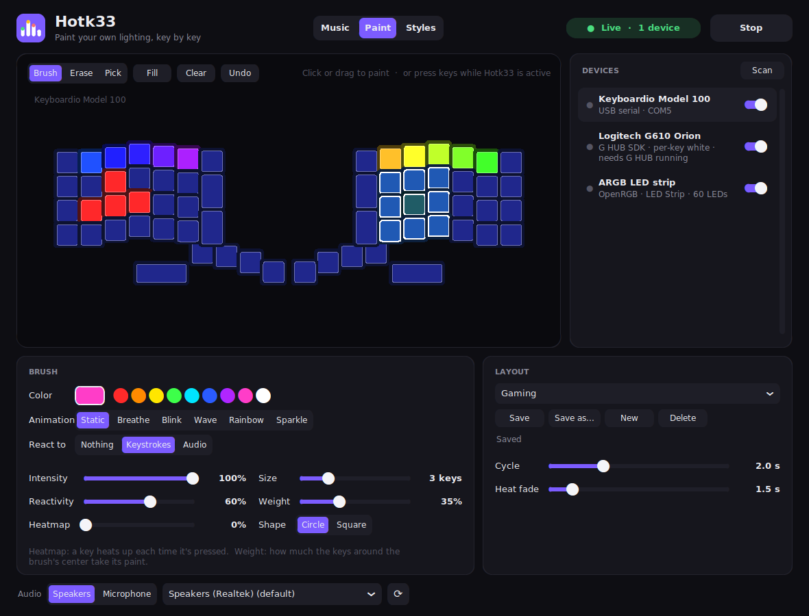
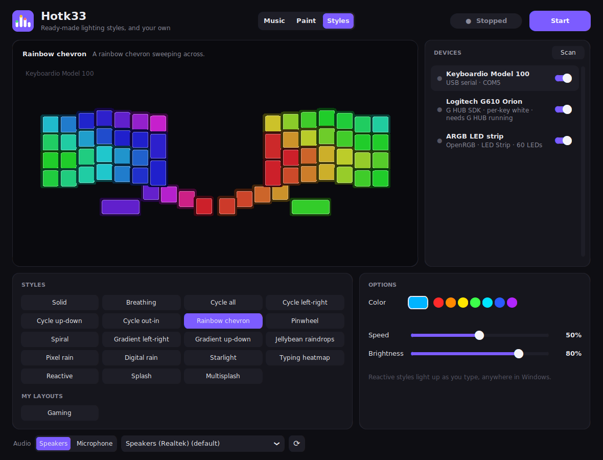

# Hotk33

One app for your RGB keyboard, mouse and ARGB lighting on Windows, with three modes:

- **Music**: your lighting reacts to whatever is playing: spectrum bars, beat
  pulses, ripples and VU meters, with a per-band sensitivity equalizer. Works
  on keyboards, mice, motherboard ARGB, fans, strips, RAM, GPUs and more.
- **Paint**: paint your own lighting, key by key, with the mouse or by
  pressing the keys themselves. Each key gets a color, an animation, an
  intensity, and can react to being pressed (a heatmap), to every keystroke or
  to audio. Save what you paint as layouts.
- **Styles**: ready-made lighting styles, like the effects in Keychron's
  Launcher (rainbow waves, breathing, raindrops, typing heatmap, splashes...),
  and the layouts you saved in Paint mode, one click each.

Pick the mode at the top of the window and press **Start**. One mode runs at a
time (they would fight over the same keys); switching modes while running
hands the lights straight over.

Hotk33 combines what used to be two separate apps, RGB Music Visualizer and
Predictive Key Lights. On first start it picks up their settings. Close the
old apps before running Hotk33.

**Typing mode** (Predictive Key Lights: the keys you're likely to type next
light up) is switched off for now, while a crash in it is fixed.


## Install

1. Download `Hotk33-<version>-windows-x64.zip` from the
   [latest release](https://github.com/vantfindthe/hotk33/releases/latest) and
   unzip it anywhere. No Python needed.
2. Run `Hotk33.exe`. It lists the devices it finds; pick a mode and press
   **Start**. (It isn't code-signed, so SmartScreen may ask: **More info**,
   then **Run anyway**.)

Settings and saved layouts are in `%APPDATA%\Hotk33`. If Hotk33 ever
crashes, the details are in `crash.log` there: please attach it to a bug
report.

To run from source instead (Windows 10/11 and
[Python 3.12](https://www.python.org/downloads/)):

```bat
git clone https://github.com/vantfindthe/hotk33 Hotk33
cd Hotk33
setup.bat
```

Then start it with `Hotk33.bat`.

## Devices

Devices are found automatically (**Scan** checks again). Switch each one on or
off in the device list; in Music mode, click a device to preview it, and in
Paint and Styles mode to paint or preview it. A keyboard that's
plugged in but can't be lit yet is listed too, marked with what it needs (for
example, start Synapse, or connect the Keychron with a cable).

| Devices | How | Needs | Lit | Knows its keys |
|---|---|---|---|---|
| Keyboardio Model 100 | Focus serial + MusicLEDs firmware | this project's firmware ([below](#keyboardio-model-100-firmware)); Chrysalis closed | ✓ | ✓ |
| Logitech G keyboards & mice | G HUB LED SDK | G HUB running, with "allow games & applications to control lighting" on | ✓ | keyboards |
| Razer Chroma keyboards, mice, mousepads, headsets, keypads, Chroma Link / ARGB controller | Chroma SDK REST API | Razer Synapse with the Chroma SDK / Chroma Connect module | ✓ | keyboards |
| SteelSeries keyboards (Apex, ...) | GameSense | SteelSeries GG (Engine) running | typing keys only | ✓ |
| Keychron and other QMK keyboards with VIA | VIA raw HID | stock VIA firmware; VIA web app closed | whole board, one color | - |
| ARGB (motherboard headers, fan/strip controllers), RAM, GPUs, and most other RGB gear, including per-key Corsair, HyperX, ASUS, Wooting, Keychron (Q, V, K Max/Pro/HE with firmware 1.1.1+, over USB) and Logitech/Razer without their vendor apps | OpenRGB SDK | [OpenRGB](https://openrgb.org) 1.0+ running with **SDK Server** started (port 6742) | ✓ | keyboards |

Notes:
- Don't drive the same device through two backends at once (e.g. a Razer
  keyboard via both Synapse and OpenRGB): switch one of them off in the list.
- Vendor apps and OpenRGB fight over devices they both control. Use OpenRGB
  for Logitech/Razer gear only with G HUB/Synapse closed.
- Keychron per-key lighting needs OpenRGB: Keychron firmware
  1.1.1+ and the USB cable (not Bluetooth / 2.4 GHz). Over VIA, Music mode
  lights the whole board in one color.
- Few-LED devices (mouse zones, whole-board keyboards) show a blend of the
  whole spectrum; strips and fan rings get the full spectrum along their length.
- "Knows its keys": Hotk33 knows which light is which key, so you can paint
  by pressing keys and the reactive styles can follow your typing. Key
  positions assume a US layout (and the default QWERTY layer on the Model 100).
- Logitech quirk: the SDK reports success even for calls a device ignores. The
  G610 only accepts the key bitmap when the target is "all devices", so the app
  uses that; white-only keyboards (G610, G710+) get brightness from each key's
  color.

Tested on real hardware: Keyboardio Model 100, Logitech G610 (white per-key)
and G502 HERO via G HUB. Razer, SteelSeries, Keychron/VIA and OpenRGB were
tested against simulated devices only. Reports welcome.

## Music mode

Choose an effect and colors, set the levels, and shape the per-band
sensitivity in the equalizer (drag to boost or cut a band, double-click to
zero, scroll to fine-tune).

**Custom** colors are a gradient you make yourself: click a color stop to
pick its color, **+** adds a stop (up to 6), right-click removes one, and
**Start from** copies a preset's colors to edit. One stop is a solid color.

Pick the audio to follow at the bottom: **Speakers** follows what's playing,
**Microphone** follows an input (a mic, or a line-in from another device).

With **Normal lighting when the music stops** on, devices get their own
lighting back after 8 s of silence. Logitech devices can take a few seconds
to switch back to Hotk33 when music resumes (that's G HUB).

## Paint mode



Pick a device in the list, then paint it:

- **With the mouse**: click or drag over the keys. The keys the brush would
  cover are outlined.
- **By keystroke**: with Hotk33 as the active window, press a key on the
  keyboard and the brush lands on that key (keyboards that know their keys,
  see [Devices](#devices)).

Tools: **Brush**, **Erase**, **Pick** (the brush takes a key's paint),
**Fill** (the whole device), **Clear**, **Undo** (also `Ctrl+Z`).

The brush:

| | |
|---|---|
| Color | any color, or one of the quick swatches |
| Animation | Static, Breathe, Blink, Wave (sweeps left to right), Rainbow, Sparkle. **Cycle** sets how long one cycle takes |
| Intensity | how bright the paint is |
| React to | **Keystrokes**: every key you press, anywhere, sends a flash rippling out from that key. **Audio**: the keys pulse with the spectrum (bass on the left, treble on the right) from the speakers or a microphone, picked at the bottom |
| Reactivity | how much they react: at 100% a key is dark until something sets it off, at 50% it rests at half brightness |
| Heatmap | the key heats up (orange, yellow, white-hot) each time it's pressed, and cools down over **Heat fade** |
| Size | how many keys across the brush covers |
| Shape | a circle or a square of that size |
| Weight | how strongly the keys around the brush's center take its paint: at 100% all of them fully, lower values blend it into what's there toward the edge |

**Layouts**: **Save** keeps what's painted on every device under a name,
**Save as...** under a new one, **New** starts over, **Delete** removes the
saved layout. Pick a saved layout in the drop-down to load it. What you're
painting is kept between sessions even if you don't save it. Layouts are in
`%APPDATA%\Hotk33\paint_layouts.json`.

Press **Start** to light the devices: each one shows its painted layout (a
device with nothing painted keeps its own lighting). Keystrokes are read only
while Paint mode runs and something painted reacts to them (heatmap or
keystrokes), and only which key was pressed. In password fields keys don't
heat up or ripple from where you typed.

## Styles mode



Click a style and press **Start**; every device shows it. Click another to
switch while it runs. **Color** sets the color of the styles that use one,
**Speed** and **Brightness** apply to all.

| Styles | |
|---|---|
| Solid, Breathing | one color, steady or fading in and out |
| Cycle all, Cycle left-right, Cycle up-down, Cycle out-in, Rainbow chevron, Pinwheel, Spiral | rainbows moving across, down, inward, as a chevron, or turning around the center |
| Gradient left-right, Gradient up-down | a still gradient starting from the color |
| Jellybean raindrops, Pixel rain, Starlight | keys fading in and out at random |
| Digital rain | green code raining down |
| Typing heatmap, Reactive, Splash, Multisplash | react to typing: keys heat up, light up when pressed, or send rings of color out from the key pressed |

**My layouts** lists the layouts you saved in Paint mode. Reactive styles
read which keys you press, anywhere in Windows, only while they run; password
fields are handled as in Paint mode.

## Keyboardio Model 100 firmware

The stock firmware can't take LED colors from a PC, so the Model 100 needs
`Model100-MusicLEDs-<version>.bin` (built by `packaging\build_release.py`, or
from a release): the stock Model 100 firmware (Kaleidoscope 1.99.9) plus the
small `MusicLEDs` plugin. The plugin uses no EEPROM, so your Chrysalis keymap,
colors and macros are kept.

To flash it, close Chrysalis and Hotk33, then either
- in Chrysalis, use **Firmware Update** with the custom firmware file option, or
- with [dfu-util](https://dfu-util.sourceforge.net/): hold **Prog** (top-left key)
  while plugging the keyboard in, then run
  `dfu-util -d 3496:0005 -D Model100-MusicLEDs-<version>.bin -R`

The plugin adds these Focus serial commands:

| Command | Effect |
|---|---|
| `music.frame <384 hex>` | Show one frame: 64 keys × `RRGGBB`, matrix order (4 rows × 16 cols) |
| `music.stop` | Give the LEDs back to the normal LED mode |
| `music.info` | `rows cols timeout_ms` |

If no frame arrives for 1.5 s, the keyboard returns to its normal lighting by
itself. If Chrysalis later flashes its stock firmware, Hotk33 shows
"Firmware can't take LED frames" - flash this firmware again.

## Building from source

After `setup.bat`, run from source with `Hotk33.bat`.

**Releases are built automatically**: publishing a release on GitHub runs
the *Build release* workflow (`.github/workflows/release.yml`), which builds
the standalone app on Windows, checks it starts (`Hotk33.exe --self-test`),
builds the Model 100 firmware, and attaches both to the release. The version
in `app/version.py` must match the release tag (`2.1.0` for `v2.1.0`). It can
also be run by hand from the Actions tab, to just build the files.

To build them yourself (standalone app zip + firmware .bin into `dist\`):

```bat
.venv\Scripts\pip install -r packaging\requirements-dev.txt
.venv\Scripts\python packaging\build_release.py
```

Firmware: install [arduino-cli](https://arduino.github.io/arduino-cli/), add the
board index `https://raw.githubusercontent.com/keyboardio/boardsmanager/main/package_keyboardio_index.json`,
install the `keyboardio:gd32` core, then run `firmware\flash.bat [COMport]`
(builds, reboots the keyboard into its bootloader - hold **Prog** - and flashes).

Screenshots: `.venv\Scripts\python tools\screenshots.py` renders the ones in
`docs\` with simulated devices and scripted typing.

### Layout

| Path | What |
|---|---|
| `app/app.py` | the window (CustomTkinter): mode switch, device list, Start/Stop, settings |
| `app/widgets.py` | colors, device preview, icon |
| `app/devices/` | one module per backend (`model100`, `logitech`, `razer`, `steelseries`, `openrgb_devices`, `qmk_via`), shared by both modes, plus connected-keyboard detection (`hardware`) |
| `app/layout.py`, `app/keys.py` | where each device's LEDs are; which key types which character |
| `app/music/` | Music mode: WASAPI capture (speakers or microphone) and FFT bands (`audio`, `audiopicker`), effects, the render loop with one sender thread per device (`engine`), its part of the window (`page`) |
| `app/paint/` | Paint mode: patterns, brushes and animations (`pattern`), the render loop (`engine`), saved layouts (`store`), the paintable preview (`canvas`), its part of the window (`page`) |
| `app/styles/` | Styles mode: the style catalog (`catalog`), its render loops built on Paint's (`engine`), its part of the window (`page`) |
| `app/predictive/` | Typing mode (switched off for now; the keyboard hook and password-field detection are also used by Paint and Styles): keystrokes -> predictions -> frames (`engine`), the keyboard hook (`hook`), prediction models (`predict`, `modes/`, `words_en.txt`), Auto mode (`modes.py`), password-field detection (`secure`), its part of the window (`page`) |
| `firmware/Model100/` | Model 100 sketch + `MusicLEDs.h` plugin |
| `tools/` | trains the Typing models (`build_modes.py`, `seeds/`), regenerates the word list, renders the screenshots |
| `packaging/` | release build |

English prediction: every word that starts with what you've typed votes for
its next letter, weighted by how common it is. A finished word votes for space
and punctuation. A letter-trigram model covers names and typos. Code and
terminal modes use a 7-character n-gram model (trained with indentation
stripped, since editors insert it) blended with completion from the mode's
vocabulary.

## License

GPL-3.0 - see [LICENSE](LICENSE). The firmware is based on
[Kaleidoscope](https://github.com/keyboardio/Kaleidoscope) (GPL-3.0).
