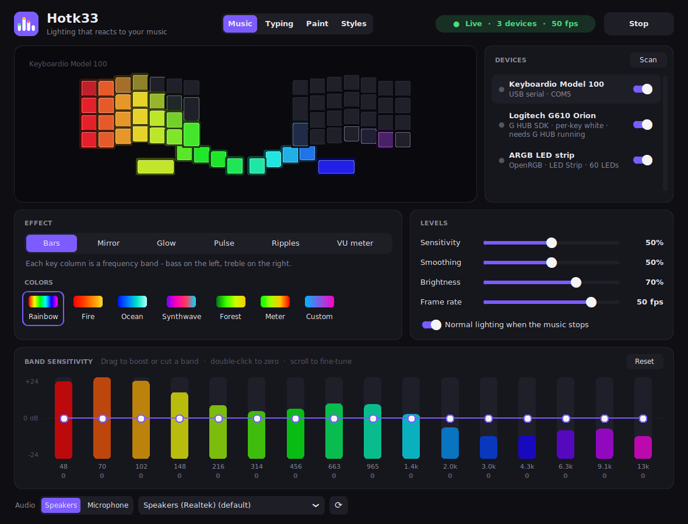
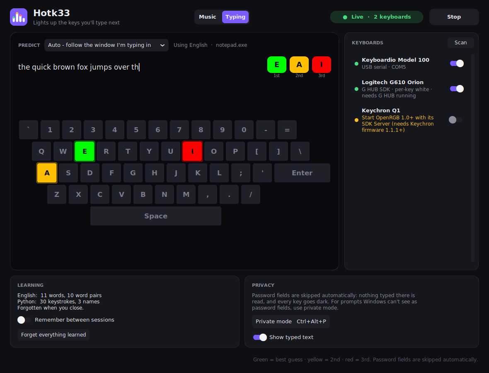
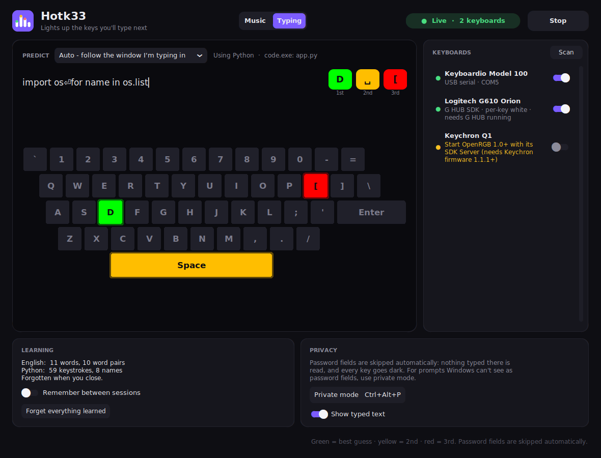
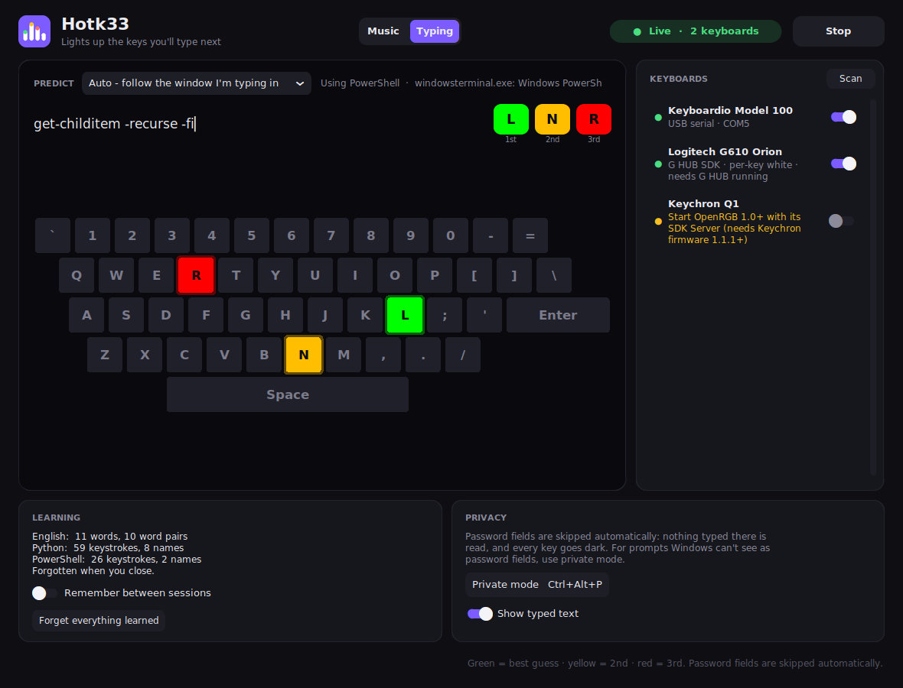
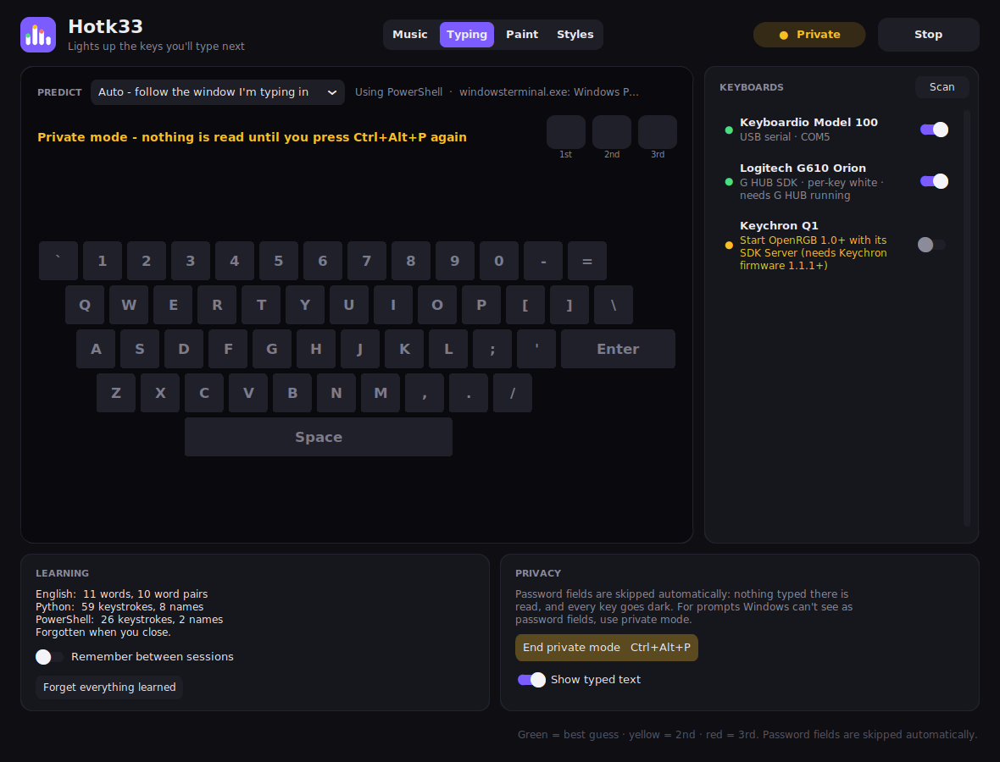

# Hotk33

One app for your RGB keyboard, mouse and ARGB lighting on Windows, with two modes:

- **Music**: your lighting reacts to whatever is playing: spectrum bars, beat
  pulses, ripples and VU meters, with a per-band sensitivity equalizer. Works
  on keyboards, mice, motherboard ARGB, fans, strips, RAM, GPUs and more.
- **Typing**: your keyboard shows you what you're about to type. After every
  key press, the key you're most likely to press next lights up **green**,
  the second most likely **yellow**, and the third **red**. It knows whether
  you're writing English, Python, JavaScript or a PowerShell, cmd or bash
  command, and learns how you type.

Pick the mode at the top of the window and press **Start**. One mode runs at a
time (both would fight over the same keys); switching modes while running
hands the lights straight over.

Hotk33 combines what used to be two separate apps, RGB Music Visualizer and
Predictive Key Lights. On first start it picks up their settings (and what
Predictive Key Lights learned). Close the old apps before running Hotk33.



## Install

Needs Windows 10/11 and [Python 3.12](https://www.python.org/downloads/).

```bat
git clone https://github.com/vantfindthe/Hotk33
cd Hotk33
setup.bat
```

Then start it with `Hotk33.bat`. Everything it needs is included, so it runs
without an internet connection after setup. Settings are saved in
`%APPDATA%\Hotk33`.

A standalone build (no Python needed) is made with `packaging\build_release.py`,
see [Building](#building-from-source).

## Devices

Devices are found automatically (**Scan** checks again). Switch each one on or
off in the device list; in Music mode, click a device to preview it. Typing
mode lists only keyboards that can light single keys. A keyboard that's
plugged in but can't be lit yet is listed too, marked with what it needs (for
example, start Synapse, or connect the Keychron with a cable).

| Devices | How | Needs | Music | Typing |
|---|---|---|---|---|
| Keyboardio Model 100 | Focus serial + MusicLEDs firmware | this project's firmware ([below](#keyboardio-model-100-firmware)); Chrysalis closed | ✓ | ✓ |
| Logitech G keyboards & mice | G HUB LED SDK | G HUB running, with "allow games & applications to control lighting" on | ✓ | keyboards |
| Razer Chroma keyboards, mice, mousepads, headsets, keypads, Chroma Link / ARGB controller | Chroma SDK REST API | Razer Synapse with the Chroma SDK / Chroma Connect module | ✓ | keyboards |
| SteelSeries keyboards (Apex, ...) | GameSense | SteelSeries GG (Engine) running | typing keys only | ✓ |
| Keychron and other QMK keyboards with VIA | VIA raw HID | stock VIA firmware; VIA web app closed | whole board, one color | - |
| ARGB (motherboard headers, fan/strip controllers), RAM, GPUs, and most other RGB gear, including per-key Corsair, HyperX, ASUS, Wooting, Keychron (Q, V, K Max/Pro/HE with firmware 1.1.1+, over USB) and Logitech/Razer without their vendor apps | OpenRGB SDK | [OpenRGB](https://openrgb.org) 1.0+ running with **SDK Server** started (port 6742) | ✓ | keyboards |

Notes:
- Don't drive the same device through two backends at once (e.g. a Razer
  keyboard via both Synapse and OpenRGB): switch one of them off in the list.
- Vendor apps and OpenRGB fight over devices they both control. Use OpenRGB
  for Logitech/Razer gear only with G HUB/Synapse closed.
- Keychron per-key lighting (and Typing mode) needs OpenRGB: Keychron firmware
  1.1.1+ and the USB cable (not Bluetooth / 2.4 GHz). Over VIA, Music mode
  lights the whole board in one color.
- Few-LED devices (mouse zones, whole-board keyboards) show a blend of the
  whole spectrum; strips and fan rings get the full spectrum along their length.
- Typing mode's key positions assume a US layout (and the default QWERTY
  layer on the Model 100).
- Logitech quirk: the SDK reports success even for calls a device ignores. The
  G610 only accepts the key bitmap when the target is "all devices", so the app
  uses that; white-only keyboards (G610, G710+) get brightness from each key's
  color in Music mode, and show the three guesses as bright, medium and dim in
  Typing mode.

Tested on real hardware: Keyboardio Model 100, Logitech G610 (white per-key)
and G502 HERO via G HUB. Razer, SteelSeries, Keychron/VIA and OpenRGB were
tested against simulated devices only. Reports welcome.

## Music mode

Choose an effect and colors, set the levels, and shape the per-band
sensitivity in the equalizer (drag to boost or cut a band, double-click to
zero, scroll to fine-tune). Pick the audio to follow at the bottom: the
speakers (what's playing) or a microphone.

With **Normal lighting when the music stops** on, devices get their own
lighting back after 8 s of silence. Logitech devices can take a few seconds
to switch back to Hotk33 when music resumes (that's G HUB).

## Typing mode



Type `t` and **H** lights up (then **O**, **R**). Type `th` and you get **E**,
**A**, **I**. After `the` it's **Space**.

| | |
|---|---|
|  |  |
| Python in VS Code: after `os.list` comes **D** (`listdir`) | PowerShell in Windows Terminal: `-Fi` → **L** (`-Filter`) |

| Mode | Predicts from | Picked automatically when you type in |
|---|---|---|
| English | 59,000-word frequency list ([wordfreq](https://github.com/rspeer/wordfreq)) | anything else |
| Python | the Python standard library | an editor or IDE with a `.py` file in its title |
| JavaScript / TypeScript | Node.js and npm sources | `.js .mjs .cjs .jsx .ts .tsx` |
| PowerShell | Windows PowerShell modules and common commands | `powershell`, `pwsh`, PowerShell tabs in Windows Terminal (and unknown terminals) |
| Command Prompt | `.bat`/`.cmd` files and common commands | `cmd.exe`, Command Prompt tabs |
| Bash / Git Bash / WSL | Git for Windows shell scripts and common commands | Git Bash (mintty), `wsl`, `bash`, tabs titled `MINGW64`, `user@host:~` ... |

**Auto** (the default) follows the window you're typing in. Pick a mode in the
drop-down to fix it. In code and terminal modes **Enter** can light up too,
and pressing it carries the context to the next line.

Keystrokes are only read while Typing mode is running. In Music mode, or when
stopped, Hotk33 doesn't watch the keyboard at all.

### It learns how you type

English learns your words and which word you type after which. Code and
terminal modes learn your names (identifiers, commands) and your character
patterns. What you type is mixed in by confidence, so a word or pattern you've
used once or twice already shows up. Type "hi claude" once and `hi ` lights
**C** next time.

The **Learning** card counts what each mode has picked up. It stays in memory
unless **Remember between sessions** is on. Then it's saved (every minute, when
you stop, and on close) to `%APPDATA%\Hotk33\learned.json`, on your PC only.
**Forget everything learned** wipes it.

### Passwords and private mode



- **Password fields are skipped automatically.** This covers browsers, most
  apps, Windows sign-in prompts and classic password boxes (it uses Windows UI
  Automation). Keystrokes there aren't recorded or learned, the context around
  them is dropped, and every key goes dark so the lights give nothing away.
- **Private mode, `Ctrl+Alt+P`**, does the same by hand, from anywhere, for
  prompts Windows can't see as password fields: `sudo`, `ssh`,
  `Read-Host -AsSecureString`, a password typed into a chat... Press it before
  typing and again after. A rising beep means private, a falling beep means
  back to normal. The hotkey itself is never passed on to the app you're in.

**Show typed text** (on by default) shows what you typed in the window. Turn
it off if people can see your screen.

## Settings

Most settings are in the window. A few more are in
`%APPDATA%\Hotk33\settings.json` (edit it while Hotk33 is closed):

| Setting | Default | |
|---|---|---|
| `key_colors` | green, yellow, red | Typing mode: RGB for the 1st, 2nd and 3rd guess |
| `white_levels` | `[255, 80, 18]` | Typing mode: brightness per guess on white-only keyboards |
| `private_hotkey` | `"ctrl+alt+p"` | modifiers (`ctrl alt shift win`) + a letter, digit, `f1`-`f24`, `pause`, `scrolllock`, `insert` or `space` |
| `hotkey_sound` | `true` | beep when private mode switches |
| `idle_release_s` | `0` | Typing mode: hand the keyboards their own lighting back after this many idle seconds (0 = never) |

## Keyboardio Model 100 firmware

The stock firmware can't take LED colors from a PC, so the Model 100 needs
`Model100-MusicLEDs-<version>.bin` (built by `packaging\build_release.py`, or
from a release): the stock Model 100 firmware (Kaleidoscope 1.99.9) plus the
small `MusicLEDs` plugin. The plugin uses no EEPROM, so your Chrysalis keymap,
colors and macros are kept.

To flash it, close Chrysalis and Hotk33, then either
- in Chrysalis, use **Firmware Update** with the custom firmware file option, or
- with [dfu-util](https://dfu-util.sourceforge.net/): hold **Prog** (top-left key)
  while plugging the keyboard in, then run
  `dfu-util -d 3496:0005 -D Model100-MusicLEDs-<version>.bin -R`

The plugin adds these Focus serial commands:

| Command | Effect |
|---|---|
| `music.frame <384 hex>` | Show one frame: 64 keys × `RRGGBB`, matrix order (4 rows × 16 cols) |
| `music.stop` | Give the LEDs back to the normal LED mode |
| `music.info` | `rows cols timeout_ms` |

If no frame arrives for 1.5 s, the keyboard returns to its normal lighting by
itself. If Chrysalis later flashes its stock firmware, Hotk33 shows
"Firmware can't take LED frames" - flash this firmware again.

## Training Typing mode on your own code or shell history

```bat
.venv\Scripts\python tools\build_modes.py python --extra D:\src\my-project
.venv\Scripts\python tools\build_modes.py powershell bash --history
.venv\Scripts\python tools\build_modes.py rust --new "Rust" .rs D:\src\some-rust-repo
```

- `--extra` adds your own code to a mode.
- `--history` trains the terminal modes on your PowerShell or bash command
  history, which is the best data for them. The model then holds fragments of
  that history, so don't share the `.json.gz` it writes.
- `--new` adds a language. Auto then picks it up by file extension.

Restart Hotk33 after rebuilding.

## Building from source

After `setup.bat`, run from source with `Hotk33.bat`.

Release build (standalone app zip + firmware .bin into `dist\`):

```bat
.venv\Scripts\pip install -r packaging\requirements-dev.txt
.venv\Scripts\python packaging\build_release.py
```

Firmware: install [arduino-cli](https://arduino.github.io/arduino-cli/), add the
board index `https://raw.githubusercontent.com/keyboardio/boardsmanager/main/package_keyboardio_index.json`,
install the `keyboardio:gd32` core, then run `firmware\flash.bat [COMport]`
(builds, reboots the keyboard into its bootloader - hold **Prog** - and flashes).

Screenshots: `.venv\Scripts\python tools\screenshots.py` renders the ones in
`docs\` with simulated devices and scripted typing.

### Layout

| Path | What |
|---|---|
| `app/app.py` | the window (CustomTkinter): mode switch, device list, Start/Stop, settings |
| `app/widgets.py` | colors, device preview, icon |
| `app/devices/` | one module per backend (`model100`, `logitech`, `razer`, `steelseries`, `openrgb_devices`, `qmk_via`), shared by both modes, plus connected-keyboard detection (`hardware`) |
| `app/layout.py`, `app/keys.py` | where each device's LEDs are; which key types which character |
| `app/music/` | Music mode: WASAPI loopback capture and FFT bands (`audio`), effects, the render loop with one sender thread per device (`engine`), its part of the window (`page`) |
| `app/predictive/` | Typing mode: keystrokes -> predictions -> frames (`engine`), the keyboard hook (`hook`), prediction models (`predict`, `modes/`, `words_en.txt`), Auto mode (`modes.py`), password-field detection (`secure`), its part of the window (`page`) |
| `firmware/Model100/` | Model 100 sketch + `MusicLEDs.h` plugin |
| `tools/` | trains the Typing models (`build_modes.py`, `seeds/`), regenerates the word list, renders the screenshots |
| `packaging/` | release build |

English prediction: every word that starts with what you've typed votes for
its next letter, weighted by how common it is. A finished word votes for space
and punctuation. A letter-trigram model covers names and typos. Code and
terminal modes use a 7-character n-gram model (trained with indentation
stripped, since editors insert it) blended with completion from the mode's
vocabulary.

## License

GPL-3.0 - see [LICENSE](LICENSE). The firmware is based on
[Kaleidoscope](https://github.com/keyboardio/Kaleidoscope) (GPL-3.0).
